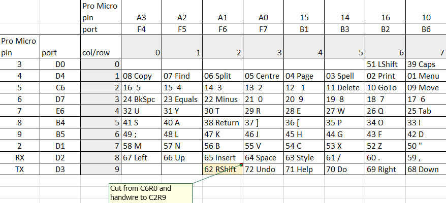
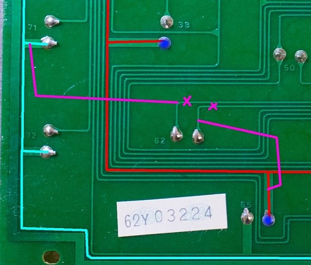
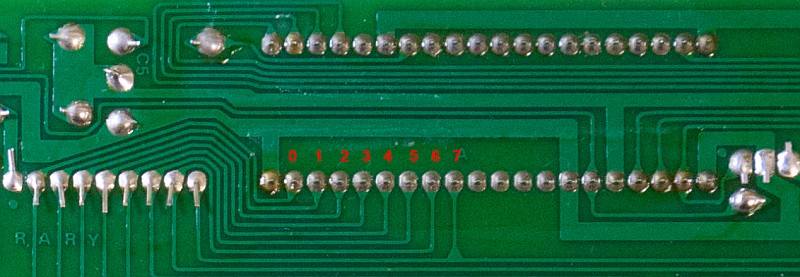
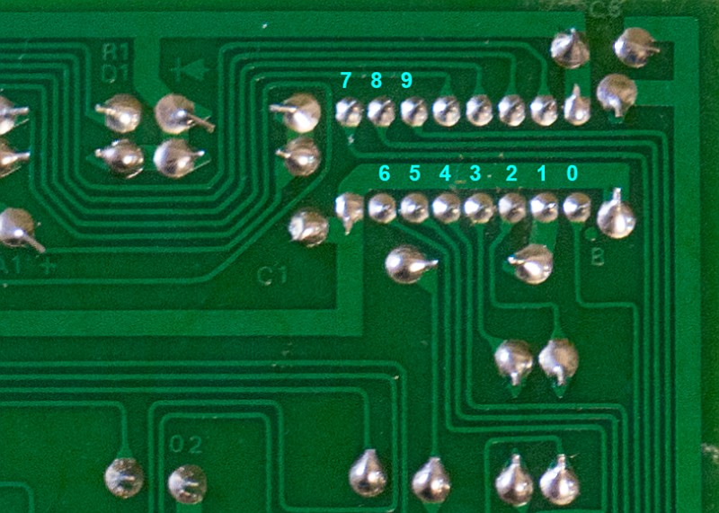
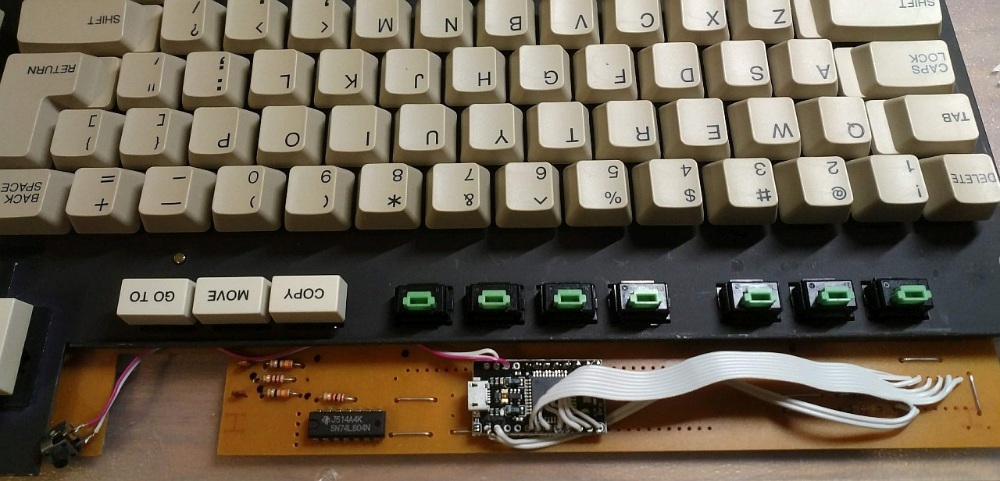

# QMK-based firmware for Magnavox Videowriter keyboard
Matrix layout is based on info from this [article](https://deskthority.net/workshop-f7/magnavox-videowriter-keyboard-cleanup-and-conversion-t19687.html).

Software: [QMK](https://github.com/qmk/qmk_firmware/).

Hardware: Pro Micro 16MHz 5V.

*Matrix:*

Right Shift (key 62 on the PCB) was separated from the left Shift (key 51) and connected to the column &#35;2 / row &#35;9.

SN74LS145N IC (BCD-to-decimal decoder, drives matrix rows), NEC D8049HC IC (MCU, drives matrix columns) and resistor array need to be desoldered from the PCB. I've also removed two electrolytic capacitors and two large ceramic capacitors just to free some additional space.

Columns pinout:

Rows pinout:

Pro Micro soldered to the PCB:

